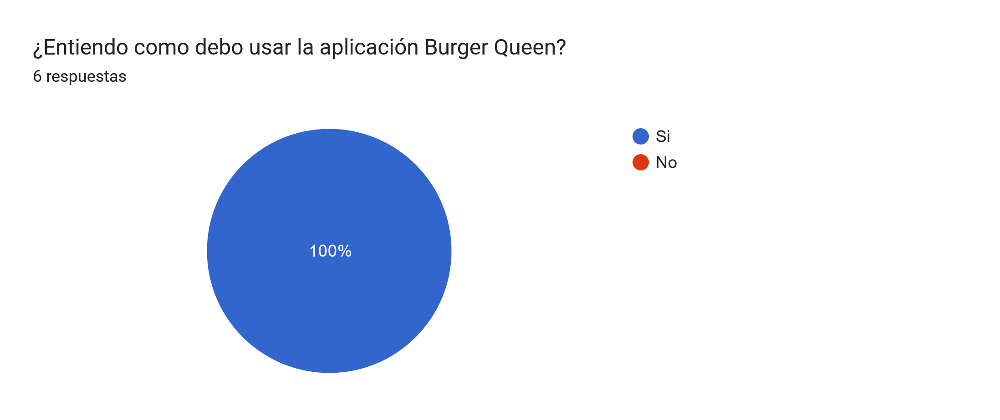
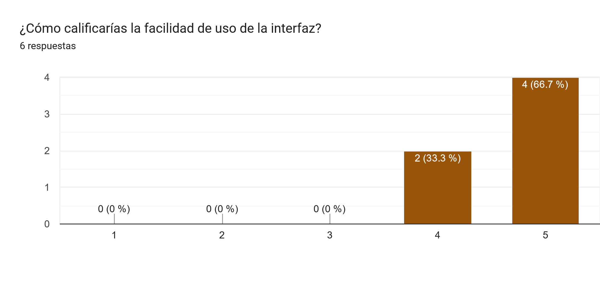
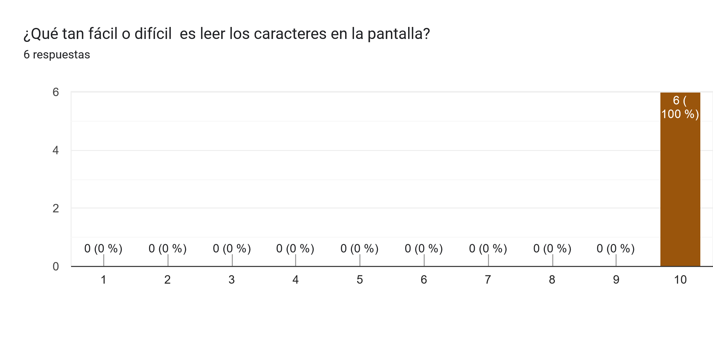
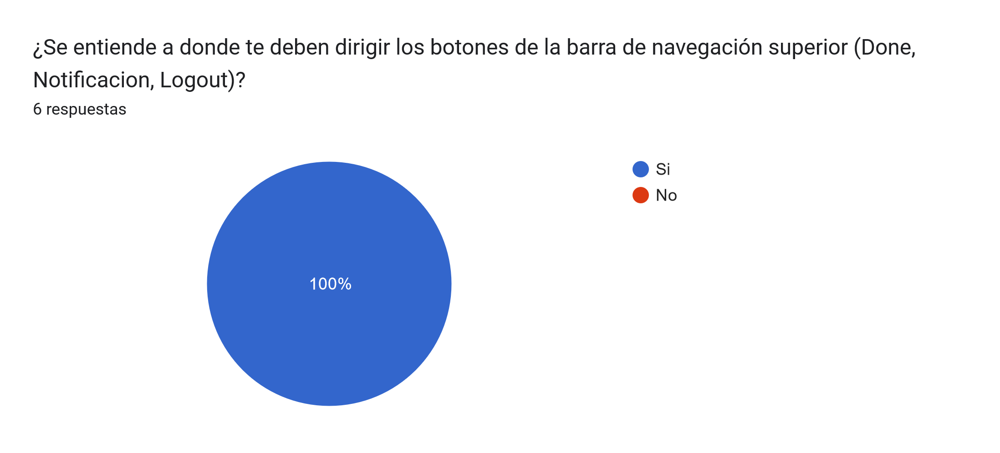
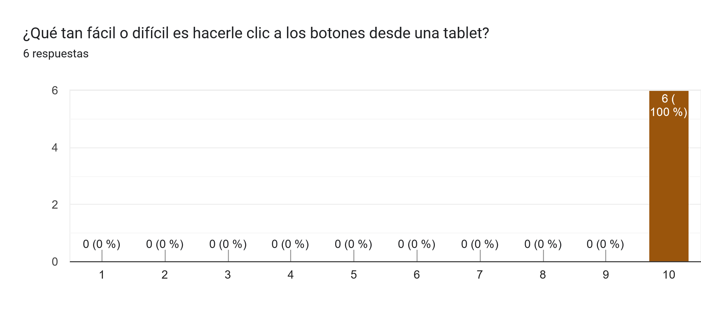

Para ingresar a la aplicación web, utilizarla y verificar su funcionalidad, ingresa a este link: [https://alextina-burger-queen-api-client.vercel.app/](https://alextina-burger-queen-api-client.vercel.app/), con los siguientes accesos: 

|Admin                    |Mesero                   |Chef (no tiene pedidos)|
|-------------------------|-------------------------|-----------------------|
|email: admin@gmail.com   |email: waiter1@gmail.com |chef1@gmail.com        |
|contraseña: 123456       |contraseña: 123456       |contraseña: 123456     |

## Índice

* [1. Resumen del proyecto](#1-resumen-del-proyecto)
* [2. Historias de Usuario](#2-historias-de-usuario)
* [3. Prototipo de Baja Fidelidad](#3-prototipo-de-baja-fidelidad)
* [4. Prototipo de Alta Fidelidad](#4-prototipo-de-alta-fidelidad)
* [5. Test de Usabilidad](#5-test-de-usabilidad)

***

## 1. Resumen del proyecto

Un pequeño restaurante de hamburguesas, que está creciendo, necesita un sistema a través del cual puedan tomar pedidos usando una tablet, y enviarlos a la cocina para que se preparen ordenada y eficientemente.

Nuestra clienta nos ha solicitado desarrollar la interfaz que se integre con la API que otro equipo de desarrolladoras está trabajando simultáneamente.

Esta es la información que tenemos del cliente:
> Somos **Burguer Queen**, una cadena de comida 24hrs.
>
> Nuestra propuesta de servicio 24hrs ha tenido muy buena acogida y, para
> seguir creciendo, necesitamos un sistema que nos ayude a tomar los pedidos de
> nuestrxs clientxs.
>
> Tenemos 2 menús: uno muy sencillo para el desayuno:
>
> | Ítem                      |Precio $|
> |---------------------------|------|
> | Café americano            |    5 |
> | Café con leche            |    7 |
> | Sandwich de jamón y queso |   10 |
> | Jugo de frutas natural    |    7 |
>
> Y otro menú para el resto del día:
>
> | Ítem                      |Precio|
> |---------------------------|------|
> |**Hamburguesas**           |   **$**   |
> |Hamburguesa simple         |    10|
> |Hamburguesa doble          |    15|
> |**Acompañamientos**        |   **$**   |
> |Papas fritas               |     5|
> |Aros de cebolla            |     5|
> |**Para tomar**             |   **$**   |
> |Agua 650ml                 |     5|
> |Agua 750ml                 |     7|
> |Bebida/gaseosa 650ml       |     7|
> |Bebida/gaseosa 750ml       |     10|
>
> Nuestros clientes son bastante indecisos, por lo que es muy común que cambien
> el pedido varias veces antes de finalizarlo.

La interfaz debe mostrar los dos menús (desayuno y almuerzo), cada uno con todos sus productos. La usuaria debe poder ir eligiendo qué productos agregar y la interfaz debe ir mostrando el resumen del pedido con el costo total.

Además la clienta nos ha dado un link a la documentación que especifica el comportamiento esperado de la API HTTP que deberás consumir. Ahí puedes encontrar todos los detalles de los endpoints, como por ejemplo qué parámetros esperan, qué deben responder, etc.

## 2. Historias de Usuario

Estas son las historias de usuario solicitadas con las que cumplimos en este proyecto.

### Historia de usuario 1 / Usuario "mesero"
**Yo como mesero quiero poder ingresar al sistema de pedidos con mis credenciales para pode visualizar los productos.**

* El usuario accede a la pantalla de login.
* El usuario ingresa con email y contraseña.
* Se muestran mensajes de error comprensibles, dependiendo de cuál es el error con la información ingresada.
* El usuario ingresa al sistema de pedidos cuando las credenciales son correctas.

### Historia de usuario 2  / Usuario "mesero"
**Yo como mesero quiero tomar el pedido de un cliente para no depender de mi mala memoria, para saber cuánto cobrar, y enviarlo a la cocina para evitar errores y que se puedan ir preparando en orden.**

* El usuario anota el nombre del cliente.
* El usuario agrega productos al pedido.
* El usuario elimina productos de la orden (pedido).
* El usuario ve el resumen y el total de la compra.
* El usuario envía el pedido a cocina.

### Historia de usuario 3 / Usuario "chef"
**Yo como jefe de cocina quiero ver los pedidos de los clientes en orden y marcar cuáles están listos para saber qué se debe cocinar y avisar a los meseros que un pedido está listo para servirlo a un cliente.**

* El  usuario ve los pedidos ordenados según se van haciendo.
* El usuario marca los pedidos que se han preparado y están listos para servirse.

### Historia de usuario 4 / Usuario "mesero"
**Yo como mesero quiero ver los pedidos que están preparados para entregarlos rápidamente a los clientes que las hicieron.**

* El usuario ve el listado de pedido listos para servir.
* El usuario marca pedidos que han sido entregados.

### Historia de usuario 5 / Usuario "administrador"
**Yo como administrador(a) de tienda quiero gestionar a los usuarios de la plataforma para mantener actualizada la información de mis trabajadores.**

* El usuario ve listado de trabajadores.
* El usuario agregar trabajadores.
* El usuario elimina trabajadores.
* El usuario actualiza los datos de los trabajadores.

### Historia de usuario 6 / Usuario "administrador"
**Yo como administrador(a) de tienda quiero gestionar los productos para mantener actualizado el menú.**

* El usuario ve listado de productos.
* El usuario agregar productos.
* El u*uario elimina productos.
* El usuario actualiza los datos de los productos.

**Todas nuestras historias de usuario, cumplen los las siguientes definiciones de terminado:**

* Se recibió code review de 4 compañeras.
* Se realizó test unitarios y, además, hemos testeado el producto manualmente.
* Hicimos tests de usabilidad e incorporaste el feedback del usuario.
* Desplegamos la aplicación (VERCEL) y hemos etiquetado tu versión (git tag).
* Mantenemos los datos íntegros, incluso después de que un pedido ha terminado.

## 3. Prototipo de Baja Fidelidad

## 4. Prototipo de Alta Fidelidad

Haz [clic aquí](https://www.figma.com/proto/DH1dAtlsEa2GlvBZd84UxV/Burguer-Queen?type=design&node-id=94-862&scaling=scale-down&page-id=0%3A1&starting-point-node-id=94%3A862) o sobre la imagen para interactuar con el prototipo.

## 5. Test de Usabilidad

Realizamos 2 encuestas para conocer la opinión del usuario con respecto al uso de la app en una TABLET.

* [Formulario 1 - Usuario "mesero"](https://forms.gle/3anzQAcg6BmP4sd67)
* [Formulario 2 - Usuario "admin" - Resultados en proceso](https://forms.gle/htW5mFBpw19zK8yP9)

### Formulario 1:

Algunos resultados:

</img>
</img>
</img>
</img>
</img>

**También, nos indicaron como recomendación:**

* Que los inputs del nombre y mesa del cliente estén arriba.
* Que se vea el menú de navegación en todo momento, para saber que se agregan productos al carrito.

Tomamos ambas recomendaciones y las aplicamos a la web.
